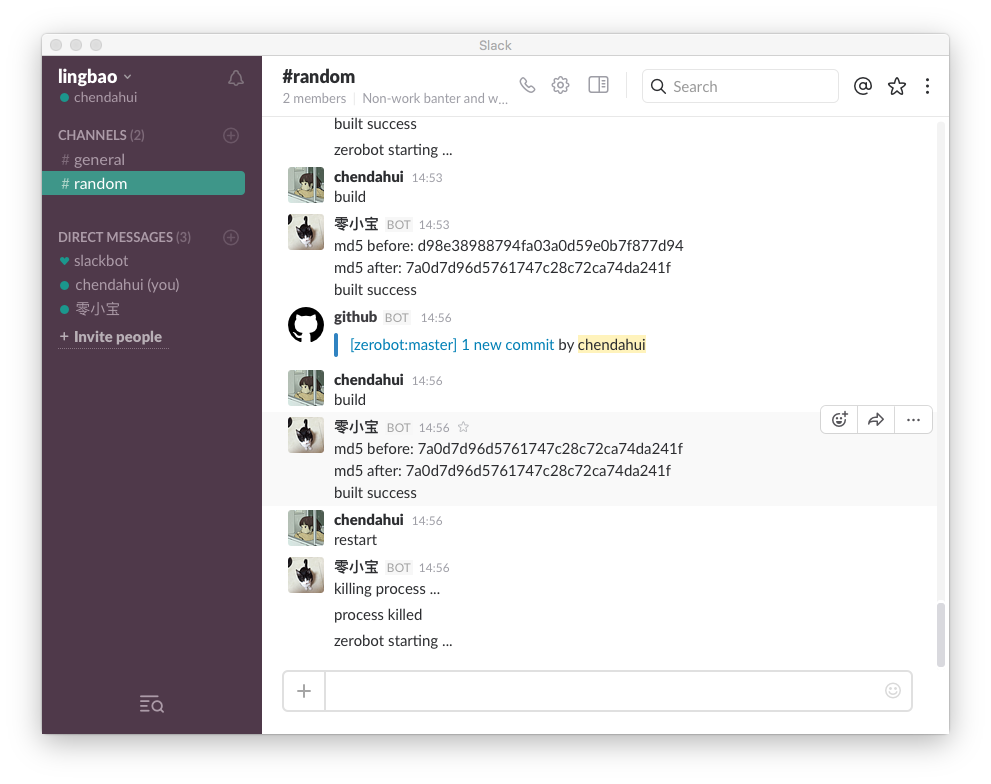

# zerobot
A slack bot made for fun


Deploy with supervisord

```
$ cat /etc/supervisor/conf.d/zerobot.conf

[program:zerobot]
user=holys
directory=/home/holys/code/src/github.com/holys/zerobot
environment=SLACK_API_TOKEN="YOUR_API_TOKEN",PATH="/usr/local/sbin:/usr/local/bin:/usr/sbin:/usr/bin:/sbin:/bin:/usr/games:/usr/local/games:/usr/local/go/bin",GOPATH=/home/holys/code
command=/home/holys/code/src/github.com/holys/zerobot/bin/zerobot
autostart=true
autorestart=true
redirect_stderr=false
stdout_logfile=/var/log/zerobot/info.log
stderr_logfile=/var/log/zerobot/error.log
```



